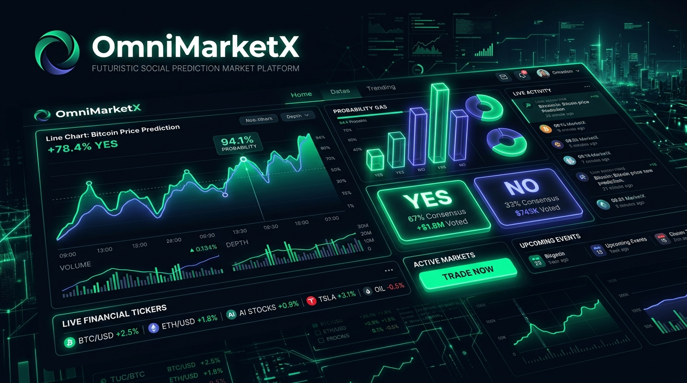
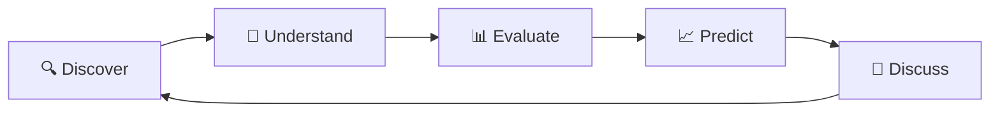

<div align="center">

  # 📈 OmniMarketX
  ### *Social Prediction Market & Simulated Trading Foundry*

  [](https://nextjs.org/)
  [](https://www.typescriptlang.org/)
  [](https://tailwindcss.com/)
  [](https://github.com/pmndrs/zustand)
  [](https://github.com/)

  <br />

  

</div>

---

## 🌟 Product Thesis

OmniMarketX is designed to transform the prediction-market experience to be:

> **Easier to understand, easier to navigate, and easier to trust**

while preserving OmniMarketX's strongest differentiator: **SOCIAL + PREDICTION**.

### Core User Journey



1. **Discover** — Explore trending, liquid, and unseeded markets with real-time filtering and search.
2. **Understand** — Inspect verified resolution criteria, primary source links, and clear data quality flags.
3. **Evaluate** — Analyze interactive historical probability charts and trader consensus metrics.
4. **Predict** — Execute simulated demo trades (**BUY YES / BUY NO**) with instant balance updates.
5. **Discuss** — Share reasoning in community threads tagged with prediction badges and held shares.

---

## 🛡️ Key UI & Trust Innovations

### 1. Data Quality & Unseeded Market Flags
* **Problem**: Standard platforms display zero-activity markets with 50% odds identically to active markets, misleading users into inferring 50/50 trader consensus.
* **Solution**: OmniMarketX explicitly flags all 0-volume, 0-trader markets with **Unseeded Badges** and warning banners explaining that 50% reflects an unpriced initial state rather than market consensus.

### 2. Actionable Empty States
* **Problem**: Traditional dashboard empty states act as dead ends without next steps.
* **Solution**: Every view (search, filter, empty portfolio, watchlist) includes primary CTAs (e.g. *"Explore Listed Markets"*, *"Reset All Filters"*).

### 3. Persistent Real / Demo Mode
* Single source of truth top banner and header toggle displaying **`$10,000.00` Demo Cash** balance vs **Real Mode Preview**.

### 4. Contextual Side Content
* Replaced repetitive generic hashtag widgets with dynamic liquidity indicators and resolution safeguard panels.

---

## 📁 Detailed Project Structure

```text
OmnimarketX/
├── public/
│   └── banner.jpg                    # High-resolution hero banner asset
├── src/
│   ├── app/
│   │   ├── layout.tsx                # App root layout & SEO metadata
│   │   ├── globals.css               # Custom dark fintech theme & scrollbars
│   │   ├── page.tsx                  # Market Discovery & Journey Stepper
│   │   ├── portfolio/
│   │   │   └── page.tsx              # Portfolio Dashboard (Positions & Fills)
│   │   └── market/
│   │       └── [id]/
│   │           └── page.tsx          # Hero Market Detail & Trading Panel
│   ├── components/
│   │   ├── layout/
│   │   │   └── Shell.tsx             # Global shell, responsive header, sidebar & drawer
│   │   ├── discovery/
│   │   │   ├── MarketCard.tsx        # Card with YES/NO odds, prices & trust warnings
│   │   │   ├── MarketFilters.tsx     # Categories, sorting, search & unseeded toggle
│   │   │   └── MarketGrid.tsx        # Responsive grid with actionable empty states
│   │   ├── trust/
│   │   │   └── TrustBadge.tsx        # Verified, High Activity & Unseeded badges
│   │   └── ui/
│   │       └── EmptyState.tsx        # Reusable component with primary CTAs
│   ├── data/
│   │   └── mockMarkets.ts            # Centralized, internally consistent 2026/2027 markets
│   ├── store/
│   │   └── useMarketStore.ts         # Zustand state engine (Demo cash, positions, trades)
│   └── types/
│       └── market.ts                 # Strongly-typed data contracts
├── package.json                      # Dependencies & NPM scripts
├── tsconfig.json                     # TypeScript configuration & path aliases
├── tailwind.config.ts                # Tailwind CSS theme extensions
├── next.config.mjs                   # Next.js configuration
└── README.md                         # Project documentation
```

---

## ⚡ Getting Started

### Prerequisites
* **Node.js**: `v18.0.0` or higher
* **NPM**: `v9.0.0` or higher

### Installation

1. Clone the repository and navigate to the directory:
   ```bash
   cd OmnimarketX
   ```

2. Install dependencies:
   ```bash
   npm install
   ```

3. Run the development server:
   ```bash
   npm run dev
   ```

4. Open [http://localhost:3000](http://localhost:3000) in your browser.

---

## 🛠️ Verification & Build Commands

```bash
# Type check TypeScript codebase
npx tsc --noEmit

# Run Next.js production build
npm run build

# Start production server
npm run start
```

---

## 📊 Market Dataset Summary

The platform comes pre-loaded with internally consistent 2026/2027 prediction markets:
* **OpenAI Next Flagship Model** (Tech · 68% YES · $485k Vol)
* **NVIDIA Consumer GPU Architecture in 2026** (Tech · 74% YES · $320k Vol)
* **Bitcoin Exceed $150,000 before Jan 2027** (Crypto · 58% YES · $1.25M Vol)
* **India GDP Growth > 7.0% in FY2026-27** (Finance · 62% YES · $210k Vol)
* **US Fed Rate Below 3.75% before Dec 2026** (Finance · 41% YES · $640k Vol)
* **SpaceX Starship Propellant Transfer in 2026** (Tech · 82% YES · $410k Vol)
* **IBM 1,000 Logical Qubit System** (*Unseeded 0-Vol Trust Example*)
* **Commonwealth Fusion Net Power Grid Delivery** (*Unseeded 0-Vol Trust Example*)

---

<div align="center">
  <sub>Built for the OmniMarketX Future Foundry Evaluation</sub>
</div>
